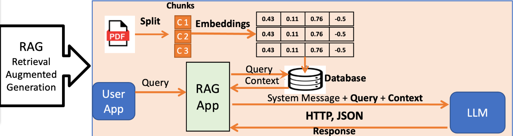
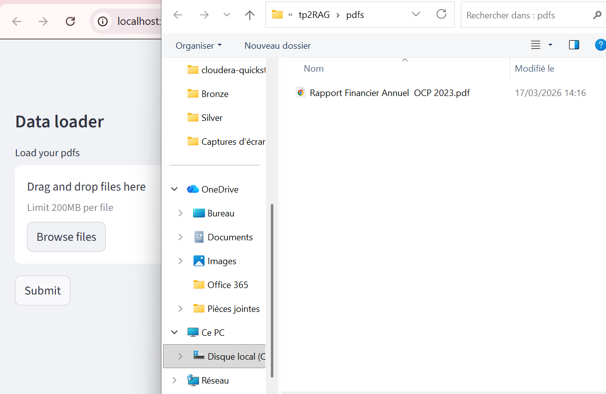
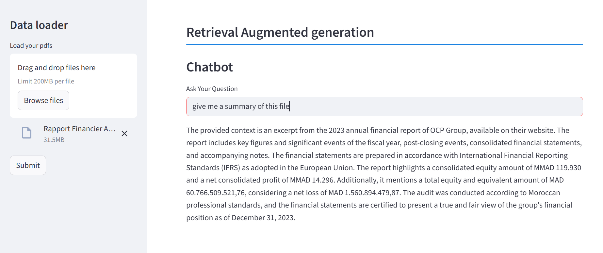

# tp2RAG - Retrieval-Augmented Generation (RAG) Chatbot

[](https://www.python.org/)
[](https://streamlit.io/)
[](https://langchain.com/)
[](LICENSE)



## 📖 Description
**tp2RAG** est une application RAG (Retrieval-Augmented Generation) éducative et fonctionnelle pour interroger des documents PDF via un chatbot Streamlit. Elle traite des rapports financiers (ex: Rapport OCP 2023), extrait le texte, génère des embeddings OpenAI, stocke en base vectorielle Chroma, et répond aux questions avec GPT-4o.

Inspiré du notebook [RAGV2.ipynb](RAGV2.ipynb) qui explique la théorie RAG et ses workflows.

**Fonctionnalités clés :**
- Upload multiple PDFs
- Chunking intelligent (Tiktoken, 512 tokens)
- Embeddings + stockage Chroma persistant
- Retrieval Top-K (k=5)
- Chatbot avec prompt contextualisé (GPT-4o)

## 🎥 Démo




## 🚀 Installation Rapide
```bash
# Clonez et installez (avec uv recommandé)
git clone <repo-url>
cd tp2RAG
uv sync

# Créez .env (OpenAI API key requise)
echo "OPENAI_API_KEY=sk-..." > .env

# Lancez l'app
streamlit run rag.py
```
Ouvrez `http://localhost:8501`.

## 📁 Structure du Projet
```
tp2RAG/
├── rag.py              # App Streamlit principale
├── main.py             # Script de test (Hello World)
├── RAGV2.ipynb         # Notebook théorique RAG
├── pyproject.toml      # Dépendances (uv/pip)
├── .env                # API keys (gitignore)
├── rag.png             # Logo app
├── pdfs/               # Documents (ex: OCP 2023)
├── store/              # Chroma DB (.sqlite3 + embeddings)
├── .gitignore
├── README.md           # Ce fichier
└── TODO.md             # Prochaines étapes
```

## 🛠️ Dépendances
- **Core**: LangChain, Chroma, OpenAI, PyPDF2, Streamlit, Tiktoken
- **Install**: `uv sync` ou `uv pip install -r requirements.txt` (généré via `uv pip compile pyproject.toml -o requirements.txt`)

## ⚙️ Configuration
1. **.env** :
   ```
   OPENAI_API_KEY=sk-your-key-here
   ```
2. **Persistance** : Vecteurs stockés en `store/chroma.sqlite3`.

## 🔧 Usage Avancé
- **Dev** : `uv run python main.py` (placeholder).
- **Notebook** : Ouvrez `RAGV2.ipynb` pour théorie + images.
- **Local LLM** : Support Ollama via LangChain (ajustez rag.py).


## 🚧 Limitations & TODO
- Support multi-PDF persistant.
- UI améliorée (historique chat, multi-langue).
- Local LLM (Ollama fallback).
- Tests unitaires.
- Docker.

## 🤝 Contribution
Forkez, PR bienvenus ! Issues pour bugs/fonctionnalités.

## 📄 License
MIT - Voir [LICENSE](LICENSE) (créez-le si absent).

## 🙏 Crédits
- Basé sur LangChain/Streamlit.
- PDF exemple : OCP 2023 (public).
- Notebook éducatif inclus.
